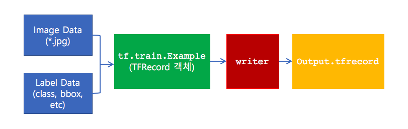

# TFRecord 변환 및 불러오기

`TFRecord`는 Tensorflow에서 지원하는 파일 형식으로,
dataset을 자체적인 바이너리 포맷으로 serialize해서 저장하는 파일 형식이다.
기본적으로는 Google의 Protocol Buffer와도 같다고 볼 수 있다.
[Google Protocol Buffer 참고](http://bcho.tistory.com/1182)

### Why TFRecord?

일반적으로 모델 학습시 image data와 레이블의 두가지 정보를 따로 불러
처리하게 되는데, 이렇게 두가지 정보를 따로 분리하여 관리하게 되면 이미지 정보와
이에 대응하는 레이블 정보를 matching해주는 코드가 추가되므로, 복잡해진다.

이에 반해, TFRecord 파일을 사용할 경우, 이미지 정보와 레이블 정보를
serialize하여 하나의 파일로 관리하기 때문에 별도의 작업없이 학습을 진행할 수 있다.

또한, 이미지 데이터가 jpg, png 등의 파일로 되어 있는 경우 매번 인코딩/디코딩 작업을
수행해 줘야 하기 때문에 학습시 비효율적인 측면이 있는데 반해, TFRecord는 파일 생성시
바이너리 데이터 포맷으로 변환해 저장하기에 이러한 부수적인 작업을 필요치 않는다.

마지막으로, 이미지 파일을 원본으로 관리하게 되면 파일 크기가 매우 커서 image dataset 자체가
차지하는 용량이 꽤 된다. TFRecord는 변환시에 이러한 파일 크기를 줄여주는 장점도 있다.

---

## TFRecord 변환 (저장하기)

image 정보와 label 정보로 부터 TFRecord를 생성하고 저장하는 절차는 다음과 같다.

1. image 정보 (파일)와 label 정보를 TFRecord 형태로 변환
2. TFRecord 형태로 변환된 serialized 정보를 파일로 저장

1단계에서 TFRecord로 변환하기 위해 `tf.train.Example` 클래스 인스턴스를 사용한다.
2단계에서는 writer 객체를 생성해서 `tf.train.Example` 인스턴스를 파일로 저장한다.



다음의 간략한 예제를 살펴보자

[TFRecord 파일 생성 예제:To-Do]

[예제 코드 출처](https://digitalbourgeois.tistory.com/50)

```python
import tensorflow as tf


def bytes_feature(values):
  return tf.train.Feature(bytes_list=tf.train.BytesList(value=[values]))

def int64_feature(values):
  if not isinstance(values, (tuple, list)):
    values = [values]
  return tf.train.Feature(int64_list=tf.train.Int64List(value=values))

def read_imagebytes(imagefile):
    file = open(imagefile,'rb')
    bytes = file.read()
    return bytes

def main():
	image_data = read_imagebytes('/datset/images/000001.jpg')
	tf_example = tf.train.Example(features=tf.train.Features(feature={
		#feature 정보 입력
      'image/encoded': bytes_feature(image_data),
      'image/format': bytes_feature(b'jpg'),
      'image/class/label': int64_feature(1),
      'image/height': int64_feature(75),
      'image/width': int64_feature(75),
	}))

	writer = tf.python_io.TFRecordWriter('/dataset/tfrecords/000001.tfrecord')
	writer.write(tf_example.SerializeToString())

if __name__ == "__main__":
    main()

```

예제에서는 height, width, 인코딩 포맷 (format), 이미지 바이너리 (encoded),
레이블 (class/label)등의 feature 정보를 생성한다.

생성된 feature 정보는 `tf.train.Features`객체를 이용하여,
`tf.train.Example` 인스턴스에 `feature` 파라미터로 전달하게 되는데 다음과 같이
dictionary 형태로 전달된다.

```python
feature={
		# feature 정보 입력
      'image/encoded': bytes_feature(image_data),
      'image/format': bytes_feature(b'jpg'),
      'image/class/label': int64_feature(1),
      'image/height': int64_feature(75),
      'image/width': int64_feature(75),
	}
```

참고로 `image/encoded` key의 value인 데이터 이미지는 `bytes_feature`를 통해
tensorflow feature 타입으로 변환하여 전달된다. 이는 `tf.train.Feature(bytes_list=tf.train.BytesList(value=\[values\]))`와 동일하다.

이와같이 생성된 `tf.train.Example` 인스턴스를 `tf.python_io.TFRecordWriter`를 이용해서
tfrecord 파일에 써주는 것이다.

```python
# writer instance 생성
writer = tf.python_io.TFRecordWriter('/dataset/tfrecords/000001.tfrecord')
# TFRecord 파일 생성
writer.write(tf_example.SerializeToString())
```

---

## TFRecord 데이터 불러오기 [[출처]](https://www.tensorflow.org/tutorials/load_data/tf_records#reading_a_tfrecord_file)

저장된 TFRecord 데이터를 불러오는 방법은 `tf.data.TFRecordDataset` 클래스를 사용한다.

```python
filenames = ['/dataset/tfrecords/000001.tfrecord']
raw_dataset = tf.data.TFRecordDataset(filenames)
```

`raw_dataset`는 `tf.train.Example` 인스턴스를 생성하게 된다.
iterator를 사용하여 하나씩 불러들이면 scalar string tensor가 반환된다.

`raw_dataset`로 부터 데이터를 불러 올때는 `.take` method를 사용한다.

다음은 `.take` method를 사용하여 10개의 정보를 불러오는 예이다.

```python
for raw_record in raw_dataset.take(10):
  print(repr(raw_record))
```

불러온 정보를 parsing하기 위해 `feature_description` dictionary를 정의해야 한다.

다음은 parsing을 위해 `_parse_function()` method 예를 나타낸다. 예에서 보여지듯이,
사용자는 `feature_description`를 정의해야 한다.

```python
# Create a description of the features.
feature_description = {
    'feature0': tf.FixedLenFeature([], tf.int64, default_value=0),
    'feature1': tf.FixedLenFeature([], tf.int64, default_value=0),
    'feature2': tf.FixedLenFeature([], tf.string, default_value=''),
    'feature3': tf.FixedLenFeature([], tf.float32, default_value=0.0),
}

def _parse_function(example_proto):
  # Parse the input tf.Example proto using the dictionary above.
  return tf.parse_single_example(example_proto, feature_description)
```

이렇게 사용자가 정의한 parsing method는 `tf.data.Dataset`의
`.map` method를 사용하여 읽어온 TFRecord를 parsing한다.

```python
parsed_dataset = raw_dataset.map(_parse_function)
parsed_dataset
```

```bash
<MapDataset shapes: {feature3: (), feature0: (), feature1: (), feature2: ()}, types: {feature3: tf.float32, feature0: tf.int64, feature1: tf.int64, feature2: tf.string}>
```

TFRecord로 변화해 저장하고 다시 불러들여 확인하는 전체 예제는 [[여기]](https://www.tensorflow.org/tutorials/load_data/tf_records#walkthrough_readingwriting_image_data)를 참조한다.

TO-DOs:
다음 정리할 것

- [[조대협의 블로그: TFRecord]](https://bcho.tistory.com/1190)
- [[Daniil's blog: Tfrecords guide]](http://warmspringwinds.github.io/tensorflow/tf-slim/2016/12/21/tfrecords-guide/)
- [TF Dataset 모듈 및 TFRecord 사용법 정리 블로그](https://hcnoh.github.io/2018-11-05-tensorflow-data-module)
- [TFRecord 파일 생성 방법 (텐서플로우 데이타 포맷)](https://digitalbourgeois.tistory.com/50)
- [Using TFRecords and tf.Example](https://www.tensorflow.org/tutorials/load_data/tf_records)

##### [[Input Data Pipeline 만들기로 돌아가기]](data_pipeline.md)|[[Tensorflow로 돌아가기]](https://github.com/elemag1414/ML_STUDY/tree/master/Tensorflow)|[[ML_STUDY로 돌아기기]](https://github.com/elemag1414/ML_STUDY)
