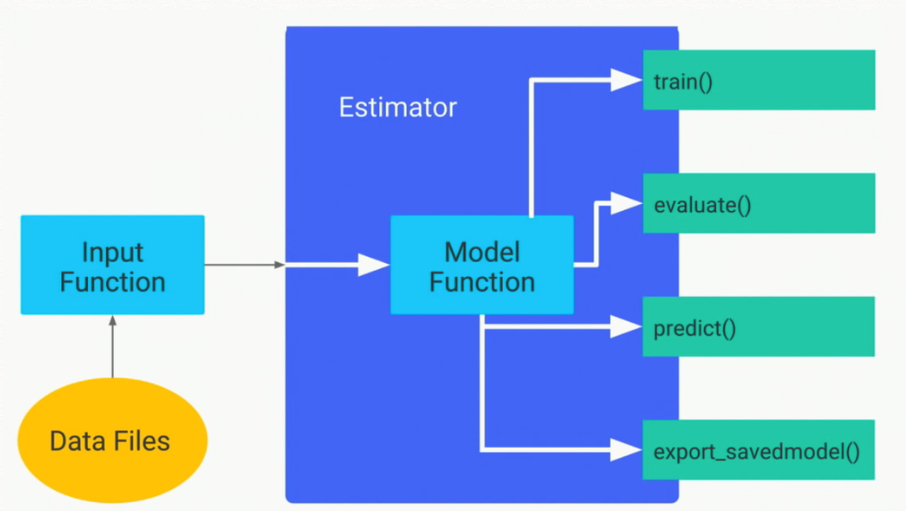

# Input Data Pipeline 만들기

Input Data Pipeline은 Model Training시 DataSet 입력에 의해 발생하는 효율 저하를 방지하는 유용하게 쓰이는 기법이다.

GPU나 TPU처럼 병렬 처리 속도가 빠른 accelerator를 사용하는 시스템의 경우,
accelerator가 training loop의 task를 처리하는 시간이
이미지 데이터를 입력하기 위해 소요되는 시간보다 훨씬 적을 수 있기 때문에
idle 상태로 지속되는 경우가 많이 발생할 수 있다.

이를 해결하고자, pipeline을 통해 accelerator가 training task를 처리하는 동안
이미지를 prefetch하는 기법이다.

Tensorflow는 이러한 Input Data Pipleline을 생성하기 위한 api를 제공한다.
본 post는 pipeline 생성 api에 대해 설명한다.

> 주, tensorflow의 api는 기습적으로 update되는 경우가 있어 현시점에 post한 내용이
> 언제까지 유효할지는 모르겠다.)
> 또한, 본 post는 version 2.x는 고려하지 않는다.
> 주로, version 1.12 혹은 1.13을 대상으로 함을 참고 바란다.

## API 구조

[Captured from](https://www.youtube.com/watch?v=5DknTFbcGVM)

Tensforflow의 ML API 구조는 대략 위와 같다.

##### [[Tensorflow로 돌아가기]](https://github.com/elemag1414/ML_STUDY/tree/master/Tensorflow)|[[ML_STUDY로 돌아기기]](https://github.com/elemag1414/ML_STUDY)
